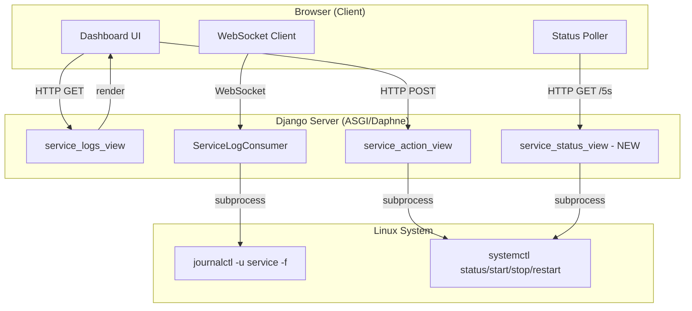
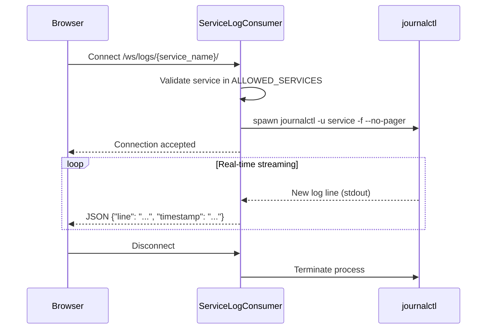
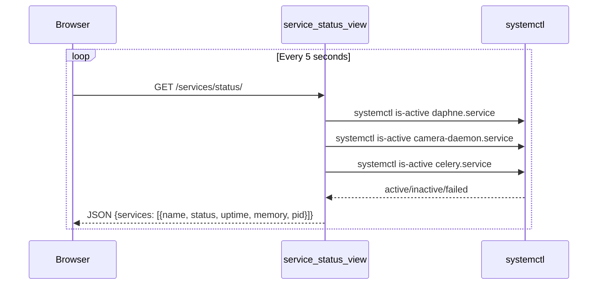
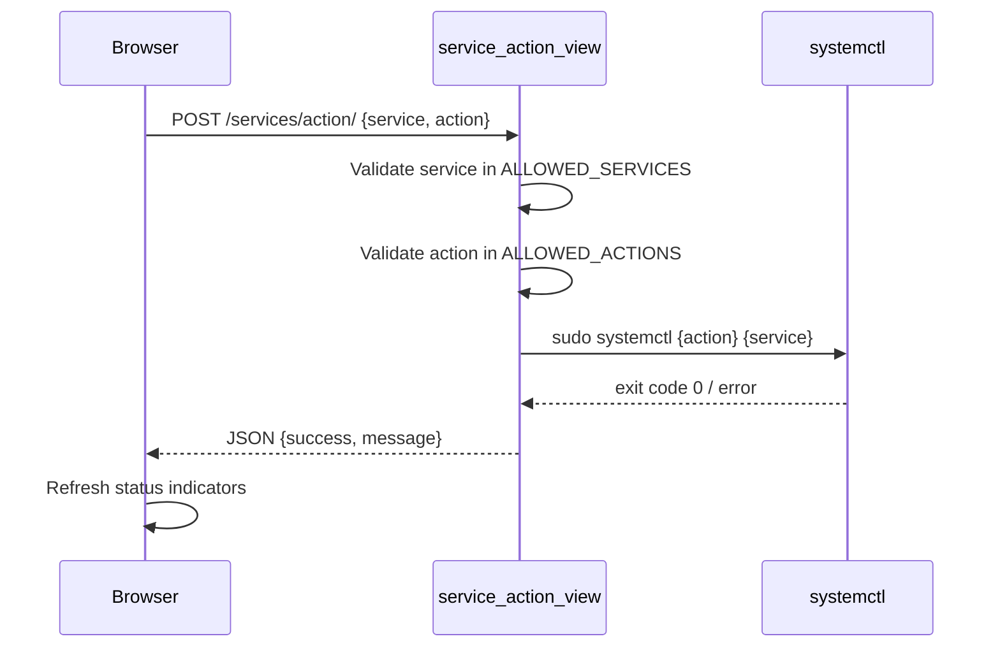

# Design Document: Service Logs Dashboard

## Overview

The Service Logs Dashboard is a redesigned `/services/logs/` page that provides a modern, clean UI for monitoring and managing exactly three systemd services: `daphne.service`, `camera-daemon.service`, and `celery.service`. The dashboard enables real-time log streaming via WebSocket, service lifecycle management (start/stop/restart), service status monitoring with visual indicators, and log filtering/search capabilities.

The current implementation already has the backend infrastructure (WebSocket consumer for log streaming, service action endpoints, unit file editing). This redesign focuses on restricting the service list to only the three target services, adding real-time status polling, implementing log search/filter, and delivering a bold modern UI with improved UX.

## Architecture



## Sequence Diagrams

### Real-Time Log Streaming



### Service Status Polling



### Service Action (Start/Stop/Restart)



## Components and Interfaces

### Component 1: ServiceLogsDashboardView (Backend)

**Purpose**: Renders the dashboard page with hardcoded list of 3 allowed services and their initial status.

**Interface**:
```python
ALLOWED_SERVICES = [
    "daphne.service",
    "camera-daemon.service",
    "celery.service",
]

@login_required
def service_logs_view(request) -> HttpResponse:
    """Render the service logs dashboard with initial service status."""
    ...
```

**Responsibilities**:
- Render the dashboard template with only the 3 allowed services
- Fetch initial status for each service on page load
- Provide CSRF token for AJAX requests

### Component 2: ServiceStatusView (Backend - NEW)

**Purpose**: API endpoint that returns current status of all 3 services for periodic polling.

**Interface**:
```python
@login_required
def service_status_view(request) -> JsonResponse:
    """Return status of all allowed services."""
    # Returns: {services: [{name, status, uptime, memory_mb, pid, cpu_percent}]}
    ...
```

**Responsibilities**:
- Query systemctl for each service's active state
- Parse uptime, PID, memory usage from `systemctl show`
- Return structured JSON for frontend status cards

### Component 3: ServiceLogConsumer (WebSocket - Enhanced)

**Purpose**: Streams real-time logs from journalctl to the browser via WebSocket.

**Interface**:
```python
class ServiceLogConsumer(AsyncWebsocketConsumer):
    ALLOWED_SERVICES = {"daphne.service", "camera-daemon.service", "celery.service"}

    async def connect(self):
        """Validate service name and start log streaming."""
        ...

    async def disconnect(self, close_code):
        """Terminate journalctl subprocess."""
        ...

    async def receive(self, text_data):
        """Handle client commands: filter, lines_count."""
        ...

    async def stream_logs(self):
        """Stream journalctl output line by line."""
        ...
```

**Responsibilities**:
- Validate that requested service is in ALLOWED_SERVICES
- Spawn `journalctl -u <service> -f --no-pager` subprocess
- Stream each line as JSON to the client
- Handle client-side commands (e.g., request last N lines)
- Clean up subprocess on disconnect

### Component 4: Dashboard UI (Frontend)

**Purpose**: Modern, responsive dashboard with service cards, log viewer, and controls.

**Interface**:
```python
# Template: templates/pages/service_logs.html
# Layout:
#   - Top: 3 Service Status Cards (horizontal)
#   - Middle: Action bar (Start/Stop/Restart/Config buttons)
#   - Bottom: Full-width terminal log viewer with search/filter
```

**Responsibilities**:
- Display 3 service cards with status indicators (running/stopped/failed)
- Provide action buttons for service management
- Real-time log viewer with auto-scroll
- Client-side log search/filter (regex support)
- Responsive layout for mobile/tablet

## Data Models

### ServiceStatus (Runtime - not persisted)

```python
from dataclasses import dataclass
from typing import Optional

@dataclass
class ServiceStatus:
    name: str                    # e.g., "daphne.service"
    display_name: str            # e.g., "Daphne (ASGI)"
    status: str                  # "active" | "inactive" | "failed" | "activating"
    sub_state: str               # "running" | "dead" | "failed" | "auto-restart"
    pid: Optional[int]           # Main PID or None
    uptime: Optional[str]        # e.g., "2h 15m" or None
    memory_mb: Optional[float]   # Memory usage in MB
    cpu_percent: Optional[float] # CPU usage percentage
    description: str             # Service description from unit file
    icon: str                    # MDI icon class for UI
    color: str                   # CSS color class for status
```

**Validation Rules**:
- `name` must be one of the 3 allowed services
- `status` must be a valid systemctl ActiveState value
- `pid` is None when service is not running

### LogLine (WebSocket Message)

```python
@dataclass
class LogLine:
    line: str           # Raw log text
    timestamp: str      # ISO timestamp extracted from journalctl
    priority: str       # "info" | "warning" | "error" | "debug"
    service: str        # Service name
```

### ServiceActionRequest (API)

```python
@dataclass
class ServiceActionRequest:
    service: str    # Must be in ALLOWED_SERVICES
    action: str     # Must be in {"start", "stop", "restart", "enable", "disable"}
```

**Validation Rules**:
- `service` must end with `.service` and be in ALLOWED_SERVICES
- `action` must be in ALLOWED_ACTIONS set

## Algorithmic Pseudocode

### Service Status Fetching Algorithm

```python
ALLOWED_SERVICES = ["daphne.service", "camera-daemon.service", "celery.service"]

SERVICE_META = {
    "daphne.service": {"display_name": "Daphne (ASGI)", "icon": "mdi-web", "color": "primary"},
    "camera-daemon.service": {"display_name": "Camera Daemon", "icon": "mdi-camera", "color": "success"},
    "celery.service": {"display_name": "Celery Worker", "icon": "mdi-cog-transfer", "color": "warning"},
}

def get_service_status(service_name: str) -> ServiceStatus:
    """
    Fetch service status from systemctl.
    
    Preconditions:
        - service_name is in ALLOWED_SERVICES
        - systemctl is available on the system
    
    Postconditions:
        - Returns a valid ServiceStatus with at minimum name and status fields
        - Never raises an exception (returns 'unknown' status on failure)
    """
    properties = [
        "ActiveState", "SubState", "MainPID",
        "ActiveEnterTimestamp", "MemoryCurrent", "Description"
    ]
    
    cmd = ["systemctl", "show", service_name, "--property=" + ",".join(properties)]
    
    try:
        output = subprocess.check_output(cmd, text=True, timeout=5)
        parsed = parse_systemctl_properties(output)
        
        # Calculate uptime from ActiveEnterTimestamp
        uptime = calculate_uptime(parsed.get("ActiveEnterTimestamp"))
        
        # Convert memory from bytes to MB
        memory_bytes = int(parsed.get("MemoryCurrent", 0) or 0)
        memory_mb = memory_bytes / (1024 * 1024) if memory_bytes > 0 else None
        
        meta = SERVICE_META[service_name]
        
        return ServiceStatus(
            name=service_name,
            display_name=meta["display_name"],
            status=parsed.get("ActiveState", "unknown"),
            sub_state=parsed.get("SubState", "unknown"),
            pid=int(parsed["MainPID"]) if parsed.get("MainPID", "0") != "0" else None,
            uptime=uptime,
            memory_mb=round(memory_mb, 1) if memory_mb else None,
            cpu_percent=None,  # Optional: can be fetched separately
            description=parsed.get("Description", ""),
            icon=meta["icon"],
            color=meta["color"],
        )
    except Exception:
        meta = SERVICE_META.get(service_name, {})
        return ServiceStatus(
            name=service_name,
            display_name=meta.get("display_name", service_name),
            status="unknown",
            sub_state="unknown",
            pid=None, uptime=None, memory_mb=None, cpu_percent=None,
            description="", icon=meta.get("icon", "mdi-help"), color="secondary",
        )
```

### Log Filtering Algorithm (Client-Side)

```python
def filter_logs(log_lines: list[str], search_query: str, level_filter: str) -> list[str]:
    """
    Filter log lines based on search query and log level.
    
    Preconditions:
        - log_lines is a list of raw log strings
        - search_query is a string (may be empty)
        - level_filter is one of: "all", "error", "warning", "info"
    
    Postconditions:
        - Returns subset of log_lines matching both criteria
        - Original log_lines list is not modified
        - Empty search_query matches all lines
    
    Loop Invariants:
        - All previously processed lines have been correctly classified
    """
    results = []
    
    for line in log_lines:
        # Level filter
        if level_filter != "all":
            line_level = detect_log_level(line)
            if line_level != level_filter:
                continue
        
        # Search filter (case-insensitive substring match)
        if search_query:
            if search_query.lower() not in line.lower():
                continue
        
        results.append(line)
    
    return results


def detect_log_level(line: str) -> str:
    """
    Detect log level from line content.
    
    Preconditions:
        - line is a non-empty string
    
    Postconditions:
        - Returns one of: "error", "warning", "info", "debug"
    """
    line_upper = line.upper()
    if "ERROR" in line_upper or "CRITICAL" in line_upper or "FATAL" in line_upper:
        return "error"
    elif "WARNING" in line_upper or "WARN" in line_upper:
        return "warning"
    elif "DEBUG" in line_upper:
        return "debug"
    return "info"
```

### Enhanced WebSocket Consumer

```python
class ServiceLogConsumer(AsyncWebsocketConsumer):
    """
    Enhanced WebSocket consumer for real-time log streaming.
    
    Preconditions:
        - Django Channels is configured with ASGI
        - User is authenticated (AuthMiddlewareStack)
        - Service name is provided in URL route
    
    Postconditions:
        - Only streams logs for ALLOWED_SERVICES
        - Cleans up subprocess on disconnect
        - Handles reconnection gracefully
    """
    ALLOWED_SERVICES = {"daphne.service", "camera-daemon.service", "celery.service"}

    async def connect(self):
        self.service_name = self.scope["url_route"]["kwargs"]["service_name"]
        
        # Security: reject unauthorized services
        if self.service_name not in self.ALLOWED_SERVICES:
            await self.close(code=4003)
            return
        
        await self.accept()
        self.proc = None
        self.task = asyncio.create_task(self.stream_logs())

    async def disconnect(self, close_code):
        if hasattr(self, 'task') and self.task:
            self.task.cancel()
        if self.proc:
            try:
                self.proc.terminate()
                await self.proc.wait()
            except Exception:
                pass

    async def receive(self, text_data):
        """Handle client commands like requesting historical logs."""
        try:
            data = json.loads(text_data)
            if data.get("action") == "get_history":
                lines_count = min(int(data.get("lines", 100)), 500)
                await self.send_history(lines_count)
        except (json.JSONDecodeError, ValueError):
            pass

    async def send_history(self, lines_count: int):
        """Send last N lines of logs (non-streaming)."""
        try:
            proc = await asyncio.create_subprocess_exec(
                "journalctl", "-u", self.service_name,
                "-n", str(lines_count), "--no-pager",
                stdout=asyncio.subprocess.PIPE,
                stderr=asyncio.subprocess.PIPE,
            )
            stdout, _ = await asyncio.wait_for(proc.communicate(), timeout=10)
            
            for line in stdout.decode(errors="ignore").splitlines():
                text = line.strip()
                if text:
                    await self.send(text_data=json.dumps({
                        "line": text,
                        "type": "history"
                    }))
        except Exception as exc:
            await self.send(text_data=json.dumps({"error": str(exc)}))

    async def stream_logs(self):
        """Stream real-time logs from journalctl -f."""
        try:
            self.proc = await asyncio.create_subprocess_exec(
                "journalctl", "-u", self.service_name,
                "-f", "--no-pager", "-n", "50",
                stdout=asyncio.subprocess.PIPE,
                stderr=asyncio.subprocess.PIPE,
            )

            while True:
                line = await self.proc.stdout.readline()
                if not line:
                    break
                text = line.decode(errors="ignore").strip()
                if text:
                    await self.send(text_data=json.dumps({
                        "line": text,
                        "type": "stream"
                    }))

        except asyncio.CancelledError:
            pass
        except Exception as exc:
            await self.send(text_data=json.dumps({"error": str(exc)}))
```

## Key Functions with Formal Specifications

### Function: get_all_services_status()

```python
def get_all_services_status() -> list[dict]:
    """Fetch status for all 3 allowed services."""
```

**Preconditions:**
- System has `systemctl` available
- Services are registered systemd units

**Postconditions:**
- Returns exactly 3 items (one per allowed service)
- Each item contains at minimum: `name`, `status`, `display_name`
- Never raises an exception

**Loop Invariants:**
- All previously fetched services have valid ServiceStatus objects

### Function: service_action_view(request)

```python
@login_required
@csrf_exempt
def service_action_view(request) -> JsonResponse:
    """Execute start/stop/restart on an allowed service."""
```

**Preconditions:**
- Request method is POST
- Request body is valid JSON with `service` and `action` fields
- User is authenticated

**Postconditions:**
- Only executes actions on ALLOWED_SERVICES (security constraint)
- Only executes ALLOWED_ACTIONS
- Returns JSON with `success` boolean and `message` string
- On success: systemctl command completed with exit code 0
- On failure: returns error message without exposing system internals

### Function: calculate_uptime(timestamp_str)

```python
def calculate_uptime(timestamp_str: str) -> Optional[str]:
    """Convert systemctl ActiveEnterTimestamp to human-readable uptime."""
```

**Preconditions:**
- `timestamp_str` is either empty/None or a valid systemctl timestamp format

**Postconditions:**
- Returns None if timestamp is empty or unparseable
- Returns human-readable string like "2h 15m" or "3d 4h"
- Never raises an exception

## Example Usage

```python
# Backend: View rendering the dashboard
@login_required
def service_logs_view(request):
    services = []
    for svc_name in ALLOWED_SERVICES:
        status = get_service_status(svc_name)
        services.append({
            "name": status.name,
            "display_name": status.display_name,
            "status": status.status,
            "sub_state": status.sub_state,
            "pid": status.pid,
            "uptime": status.uptime,
            "memory_mb": status.memory_mb,
            "icon": status.icon,
            "color": status.color,
        })

    return render(request, "pages/service_logs.html", {
        "services": services,
        "breadcrumbs": [
            {"name": "Bosh sahifa", "url": "/"},
            {"name": "Servis Loglari", "url": None},
        ],
    })


# Frontend: JavaScript status polling
"""
async function pollStatus() {
    const response = await fetch('/services/status/');
    const data = await response.json();
    
    data.services.forEach(svc => {
        updateStatusCard(svc.name, svc.status, svc.uptime, svc.memory_mb);
    });
}

setInterval(pollStatus, 5000);
"""


# Frontend: Log search/filter
"""
function filterLogs(query, level) {
    const logLines = document.querySelectorAll('.log-line');
    logLines.forEach(line => {
        const text = line.textContent.toLowerCase();
        const matchesSearch = !query || text.includes(query.toLowerCase());
        const matchesLevel = level === 'all' || detectLevel(text) === level;
        line.style.display = (matchesSearch && matchesLevel) ? '' : 'none';
    });
}
"""
```

## Correctness Properties

*A property is a characteristic or behavior that should hold true across all valid executions of a system—essentially, a formal statement about what the system should do. Properties serve as the bridge between human-readable specifications and machine-verifiable correctness guarantees.*

### Property 1: Service Restriction Enforcement

*For any* service name string not in the set {daphne.service, camera-daemon.service, celery.service}, all endpoints (HTTP and WebSocket) SHALL reject the request — HTTP endpoints with status 400, WebSocket with close code 4003.

**Validates: Requirements 1.2, 1.3, 3.3**

### Property 2: Action Validation

*For any* action string not in the set {start, stop, restart, enable, disable}, the service action endpoint SHALL reject the request with HTTP 400.

**Validates: Requirements 3.4**

### Property 3: Status Response Structure Invariant

*For any* call to the status endpoint, the response SHALL contain exactly 3 service entries, each with a status value in {active, inactive, failed, activating, unknown}.

**Validates: Requirements 1.1, 2.4**

### Property 4: Log Filter Correctness

*For any* list of log lines, search query, and level filter, the filtered result SHALL equal the intersection of lines matching the search query (case-insensitive substring) and lines matching the level filter.

**Validates: Requirements 5.1, 5.2, 5.3**

### Property 5: Log Filter Idempotency

*For any* list of log lines, search query, and level filter, applying the filter function twice SHALL produce the same result as applying it once: filter(filter(logs, q, level), q, level) == filter(logs, q, level).

**Validates: Requirements 5.1, 5.2**

### Property 6: Log Level Classification Determinism

*For any* log line string, the log level classification function SHALL always return the same level, and SHALL return "error" if the line contains ERROR/CRITICAL/FATAL, "warning" if it contains WARNING/WARN, "debug" if it contains DEBUG, and "info" otherwise.

**Validates: Requirements 5.5**

### Property 7: History Line Count Cap

*For any* requested line count N, the get_history function SHALL return at most min(N, 500) lines.

**Validates: Requirements 4.4**

### Property 8: Log Buffer Size Invariant

*For any* sequence of incoming log lines of arbitrary length, the client-side log buffer SHALL never contain more than 2000 entries.

**Validates: Requirements 4.5**

### Property 9: Error Message Truncation

*For any* systemctl error output of arbitrary length, the returned error message SHALL be at most 500 characters.

**Validates: Requirements 3.5**

### Property 10: XSS Prevention via Escaping

*For any* log line containing HTML special characters (<, >, &, ", '), the rendered DOM content SHALL contain the escaped equivalents and never raw HTML tags.

**Validates: Requirements 6.5**

### Property 11: Status Fallback on Failure

*For any* service where the systemctl status command fails or times out, the returned status SHALL be "unknown" rather than raising an exception.

**Validates: Requirements 7.3, 7.4**

## Error Handling

### Error Scenario 1: Service Not Found / Not Allowed

**Condition**: User attempts to access a service not in ALLOWED_SERVICES (e.g., via URL manipulation)
**Response**: WebSocket closes with code 4003; HTTP returns 400 with error message
**Recovery**: Frontend shows "Service not allowed" message; no retry

### Error Scenario 2: systemctl Command Failure

**Condition**: `sudo systemctl {action} {service}` returns non-zero exit code
**Response**: Return JSON `{success: false, message: <stderr output truncated to 500 chars>}`
**Recovery**: Frontend shows error toast; user can retry action

### Error Scenario 3: WebSocket Disconnection

**Condition**: Network interruption or server restart
**Response**: Frontend detects `onclose` event, shows "Disconnected" indicator
**Recovery**: Auto-reconnect after 3 seconds with exponential backoff (max 30s)

### Error Scenario 4: journalctl Process Dies

**Condition**: journalctl subprocess exits unexpectedly (e.g., service deleted)
**Response**: WebSocket sends `{error: "Log stream ended"}` and closes
**Recovery**: Frontend shows reconnect option; user can click to retry

### Error Scenario 5: Permission Denied

**Condition**: sudo not configured for the web server user
**Response**: Return JSON `{success: false, message: "Permission denied"}`
**Recovery**: Admin must configure sudoers for the web process user

## Testing Strategy

### Unit Testing Approach

- Test `get_service_status()` with mocked subprocess output
- Test `calculate_uptime()` with various timestamp formats
- Test `detect_log_level()` with different log line patterns
- Test service validation (ALLOWED_SERVICES enforcement)
- Test action validation (ALLOWED_ACTIONS enforcement)

### Property-Based Testing Approach

**Property Test Library**: hypothesis (Python)

- Property: Any service name not in ALLOWED_SERVICES is always rejected
- Property: Status response always contains exactly 3 services
- Property: Log level detection is deterministic (same input → same output)
- Property: Uptime calculation is monotonically increasing for active services

### Integration Testing Approach

- Test WebSocket connection lifecycle (connect → stream → disconnect)
- Test service action flow (POST → systemctl → response)
- Test status polling endpoint returns valid JSON structure
- Test authentication enforcement on all endpoints

## Performance Considerations

- **WebSocket Memory**: Limit client-side log buffer to 2000 lines (remove oldest when exceeded)
- **Status Polling**: 5-second interval balances freshness vs. server load (3 systemctl calls per poll)
- **Log Streaming**: journalctl `-f` is efficient (kernel-level inotify, no polling)
- **DOM Performance**: Use `document.createDocumentFragment()` for batch log line insertion
- **Search**: Client-side filtering avoids server round-trips; regex compiled once and reused

## Security Considerations

- **Service Whitelist**: Hardcoded ALLOWED_SERVICES prevents arbitrary service manipulation
- **Action Whitelist**: Only start/stop/restart/enable/disable allowed
- **Authentication**: All endpoints require `@login_required`
- **CSRF Protection**: POST endpoints validate CSRF token
- **Input Sanitization**: Service names validated against whitelist (no shell injection possible)
- **Subprocess Safety**: Using list-based subprocess calls (no shell=True)
- **Log Output**: HTML-escaped before DOM insertion to prevent XSS
- **WebSocket Auth**: AuthMiddlewareStack ensures only authenticated users connect

## Dependencies

- **Django Channels** (already installed): WebSocket support via ASGI
- **Daphne** (already installed): ASGI server
- **SweetAlert2** (already used): Toast notifications and confirmation dialogs
- **Bootstrap 5** (already used): UI framework
- **Material Design Icons** (already used): Icon set
- **No new dependencies required** - all functionality built on existing stack
